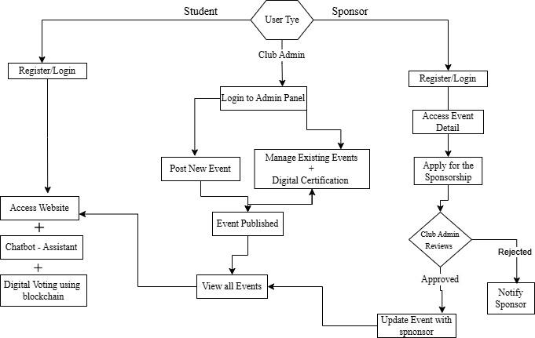

# CLUB CONNECTX  

### 🚀 Overview  
CLUB CONNECTX is a one-stop solution designed to bridge the gap between students, clubs, and opportunities within a university ecosystem. It provides a centralized platform for event management, digital voting, AI-powered assistance, and sponsorship facilitation.  

### 🎯 Problem Statement  
- No unified platform for club activities and events.  
- Low student engagement in clubs.  
- Inefficient voting and certification processes.  

### 🔥 Key Features  
✅ **Event Posting** - Clubs can list and manage events in one place.  
✅ **AI Chatbot** - Provides instant support and information.  
✅ **Sponsorship Management** - Connects clubs with sponsors seamlessly.  
✅ **Digital Voting** - Ensures secure and transparent elections using blockchain.  
✅ **Digital Certifications** - Offers verified digital certificates for event participation.  

### 🛠 Tech Stack  
- **Frontend**: React.js, Tailwind CSS  
- **Backend**: Node.js, Express.js  
- **Database**: PostgreSQL  
- **Authentication**: JWT  
- **AI Chatbot**: Gemini API  
- **Blockchain**: Smart contracts for digital voting  
- **Hosting**: AWS / Vercel  

### 🔄 Workflow  

1. **Students & Sponsors Register/Login**  
2. **Students Access Website**  
   - Browse events  
   - Use AI chatbot for assistance  
   - Participate in digital voting  
3. **Club Admin Manages Events**  
   - Posts new events  
   - Reviews sponsorship applications  
   - Issues digital certificates  
4. **Sponsors Apply for Sponsorships**  
   - Club admin reviews & approves/rejects requests  
   - Events get updated with sponsor details  

### 🎥 Demo Video  
[Link to Demo Video (To be added)]  

### 💡 Scalability & Feasibility  
- **Modular Architecture** - Independent, reusable components.  
- **Microservices Backend** - Enables independent scaling of services.  
- **Optimized Database** - Uses indexing, caching for better performance.  
- **Cloud Hosting** - AWS ensures scalability and reliability.  
- **MVP Approach** - Focuses on core features first and expands based on feedback.  

---

